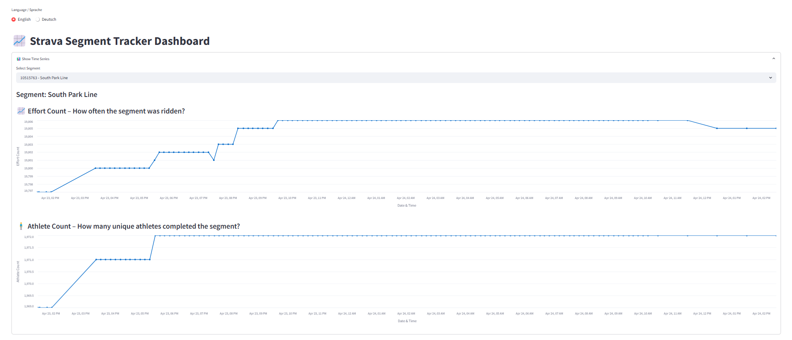

# 📈 Strava Segment Tracker

A multilingual (EN/DE) dashboard and update pipeline for monitoring efforts on Strava segments, built using **Streamlit**, **Google Sheets**, and the **Strava API**. Includes time series visualizations, unique athlete tracking, and automated updates via **Heroku**.

## 🌍 Features

- Interactive dashboard to visualize Strava segment stats
- Multilingual support (English / Deutsch)
- Google Sheets as lightweight database
- Time series charts (Effort Count, Athlete Count)
- Daily tooltips with time and weekday formatting
- Optional map view of selected segment (Strava Maps)
- Automated segment updates with Heroku scheduler

## 🖼️ Preview



## 🚀 Live App

[🔗 Open in Streamlit Cloud](https://strava-segment-tracker.streamlit.app/)

## 🖥️ Tech Stack

- [Streamlit](https://streamlit.io/)
- [Google Sheets API](https://developers.google.com/sheets/api)
- [Altair](https://altair-viz.github.io/)
- [Strava API](https://developers.strava.com/)
- [Heroku](https://www.heroku.com/) (for background tasks)

## 📦 Project Structure

```bash
strava-segment-tracker/
│
├── .streamlit/                   # Streamlit config files
│   └── secrets.toml              # API keys and credentials (not tracked, for local use)
│
├── token_handler.py             # Handles Strava OAuth token refresh
├── update_segments.py          # Fetches segment data from Strava and stores in Google Sheets
├── streamlit_app.py            # Main dashboard app
├── Procfile                    # Heroku scheduler process definition
├── requirements.txt            # Python dependencies
├── README.md                   # Project documentation
└── 📁 other utility scripts (if needed)
